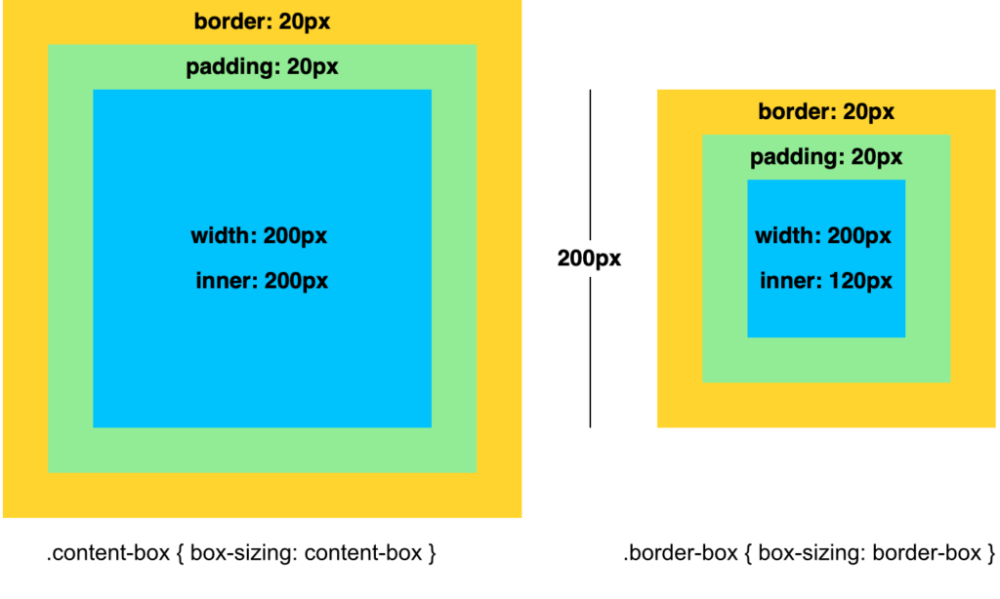

								

Je kan instellen of de dikte van de omlijning en de padding in de breedte vallen (<code>border-box</code>) van het element vallen of er buiten (<code>content-box</code>).

Standaard is “content-box” van toepassing.

<pre data-enlighter-theme="beyond" data-enlighter-language="css">
.content-box {
    border: 20px solid;
    padding: 20px;
    width: 200px;
    box-sizing: content-box;
}
</pre>

<pre data-enlighter-theme="beyond" data-enlighter-language="css">
.border-box {
    border: 20px solid;
    padding: 20px;
    width: 200px;
    box-sizing: border-box;
}</pre>

		