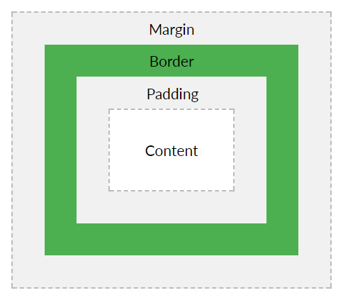
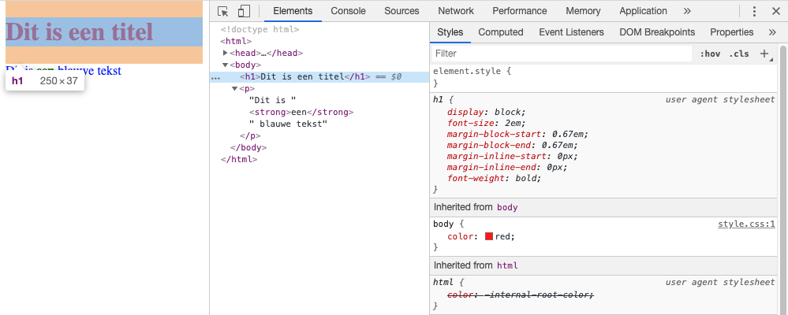

---
layout: template
title: Marge en padding
url: /css/ruimte/marge-padding
collection: [css, ruimte]
---								

<ul>
    <li>De <strong>marge</strong> is de witruimte die naar buiten wordt voorzien.</li>
    <li>De <strong>padding</strong> is de witruimte die naar binnen wordt voorzien.</li>
</ul>

Via de inspectietool zien we de beperkte standaard opmaak van een &lt;h1&gt; element (bv. de marge).