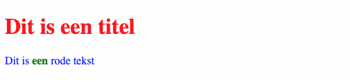

								
<blockquote>
<strong>Cascading</strong>&nbsp;(waterval / dieper) wil zeggen dat de eigenschappen niet enkel van toepassing zijn op het selector element maar ook op alle elementen binnen het selector element.
</blockquote>

HTML:

<pre data-enlighter-theme="beyond" data-enlighter-language="html">&lt;!DOCTYPE html&gt;
&lt;html&gt;
  &lt;head&gt;
    &lt;title&gt;De C van CSS staat voor Cascading&lt;/title&gt;
    &lt;meta charset="UTF-8" /&gt;
    &lt;link rel="stylesheet" type="text/css" href="css/style.css" /&gt;
  &lt;/head&gt;
  &lt;body&gt;
    &lt;h1&gt;Dit is een titel&lt;/h1&gt;
    &lt;p&gt;Dit is &lt;strong&gt;een&lt;/strong&gt; rode tekst&lt;/p&gt;
  &lt;/body&gt;
&lt;/html&gt;
</pre>

CSS:

<pre data-enlighter-theme="beyond" data-enlighter-language="html">body {
  color: red;
}
p {
  color: blue;
}
strong {
  color: green;
}</pre>

Resultaat:

Het <code>&lt;h1&gt;</code> element heeft geen specifieke kleur dus neemt het de kleur van het <code>&lt;body&gt;</code> (rood) element over.

Het <code>&lt;p&gt;</code> element normaal de kleur van het <code>&lt;body&gt;</code> element over maar heeft hier een specifieke kleur (blauw).

Het <code>&lt;strong&gt;</code> element neemt normaal de kleur van het <code>&lt;p&gt;</code> element over maar heeft hier een specifieke kleur (groen).

