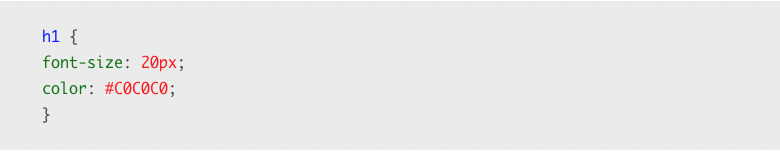

Met de <strong style="color: blue">element naam selector</strong> bepaal je op welke element(en) bepaalde <strong style="color: green">eigenschappen</strong> (properties) een bepaalde <strong style="color: red">waarde</strong> krijgen.