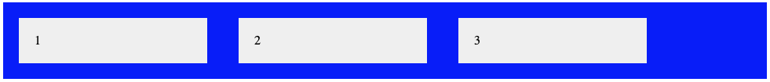
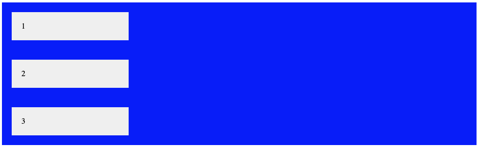
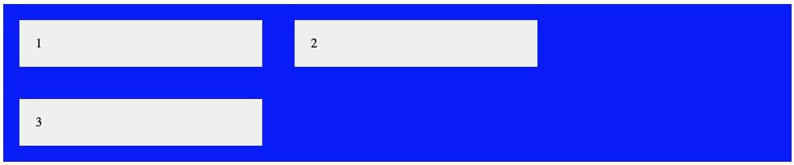
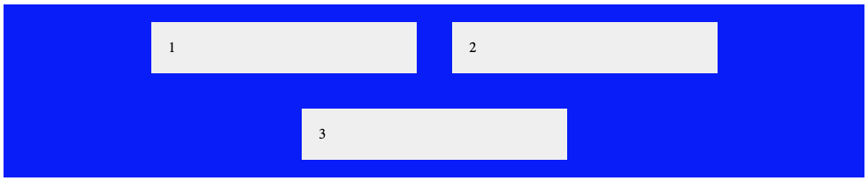
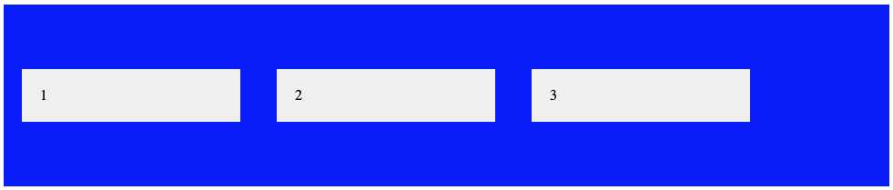

							
## Basis

Flexbox laat toe om eenvoudiger een layout te voorzien zonder floating.&nbsp;

De elementen staan rond een container element met de&nbsp;<code>display</code>&nbsp;eigenschap op&nbsp;<code>flex</code>.

HTML:

<pre data-enlighter-theme="beyond" data-enlighter-language="css">
&lt;div class="flex-container"&gt;
  &lt;div&gt;1&lt;/div&gt;
  &lt;div&gt;2&lt;/div&gt;
  &lt;div&gt;3&lt;/div&gt;
&lt;/div&gt;</pre>

CSS:

<pre data-enlighter-theme="beyond" data-enlighter-language="css">
.flex-container {
  display: flex;
  background-color: blue;
}

.flex-container &gt; div {
  padding: 20px;
  background-color: #f1f1f1;
}</pre>

Elke&nbsp;<code>&lt;div&gt;</code>&nbsp;element op het eerste niveau onder het element&nbsp;<code>.flex-container</code>, gedragen zich automatisch als een inline element.

## flex-direction

<pre data-enlighter-theme="beyond" data-enlighter-language="css">.flex-container {
  display: flex;
  background-color: blue;
  flex-direction: column;
}

.flex-container &gt; div {
  padding: 20px;
  background-color: #f1f1f1;
}</pre>

Probeer ook de ook eens met&nbsp;<code>column-reverse</code>

## flex-wrap

<pre data-enlighter-theme="beyond" data-enlighter-language="css">.flex-container {
  display: flex;
  background-color: blue;
  flex-wrap: wrap;
}

.flex-container &gt; div {
  padding: 20px;
  width: 300px;
  margin: 20px;
  background-color: #f1f1f1;
}
</pre>

## justify-content

<pre data-enlighter-theme="beyond" data-enlighter-language="css">.flex-container {
  display: flex;
  background-color: blue;
  flex-wrap: wrap;
  justify-content: center;
}

.flex-container &gt; div {
  padding: 20px;
  width: 300px;
  margin: 20px;
  background-color: #f1f1f1;
}
</pre>

Probeer ook de ook eens met&nbsp;<code>flex-end</code>

## align-items

<pre data-enlighter-theme="beyond" data-enlighter-language="css">
.flex-container {
  display: flex;
  background-color: blue;
  flex-wrap: wrap;
  align-items: center;
}

.flex-container &gt; div {
  padding: 20px;
  width: 300px;
  margin: 20px;
  background-color: #f1f1f1;
}
</pre>

