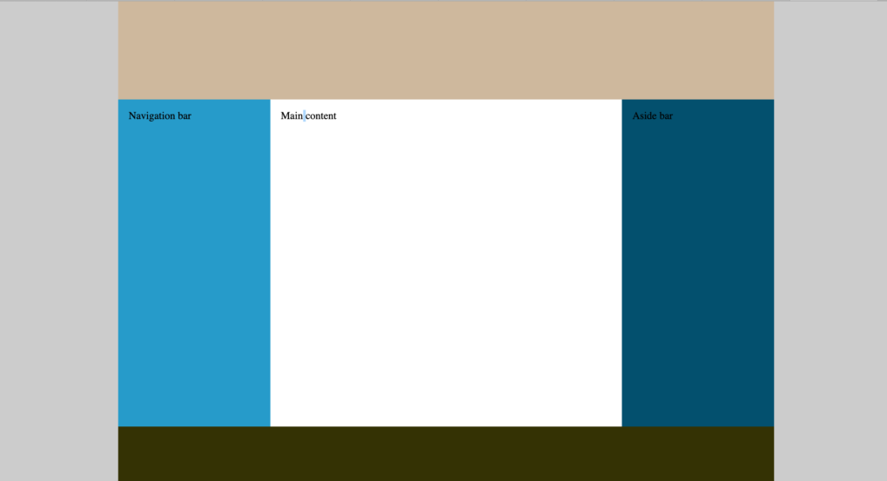

    <h3>Instructies</h3>
    <ul>
        <li>maak de bestanden aan volgens de conventies</li>
        <li>Hieronder zie je een wireframe. Een schets dus. Gebruik gerust je eigen creativiteit maar behoudt de structuur en marges/paddings.</li>
    </ul>

    <h3>TIPS</h3>
    <ol>
        <li>Schrijf <strong>EERST</strong> de <strong>HTML</strong> code, <strong>DAN</strong> pas de <strong>CSS</strong> code.</li>
        <li>Schrijf eerst de CSS voor de layout, dan pas die voor de opmaak.</li>
    </ol>        

