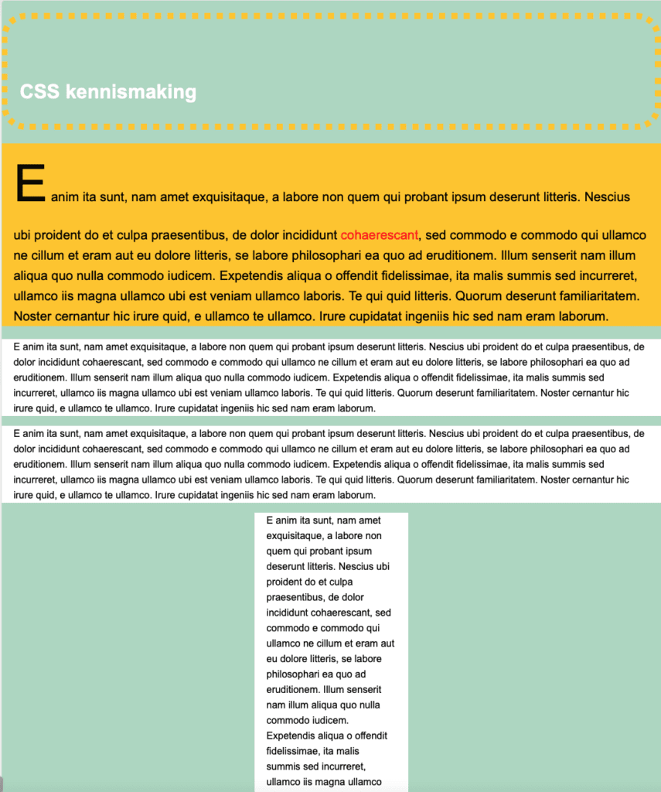

    <h3>Instructies</h3>
    <ul>
        <li>maak een folder "CSS" aan</li>
        <li>maak een in die folder "CSS" een folder "eerste experiment"</li>
        <li>maak in de laatste folder een bestand met de naam "index.html"</li>
        <li>maak in de laatste folder een bestand met de naam "style.css"</li>
        <li>Schrijf de HTML code zoals hieronder weer gegeven</li>
    </ul>

