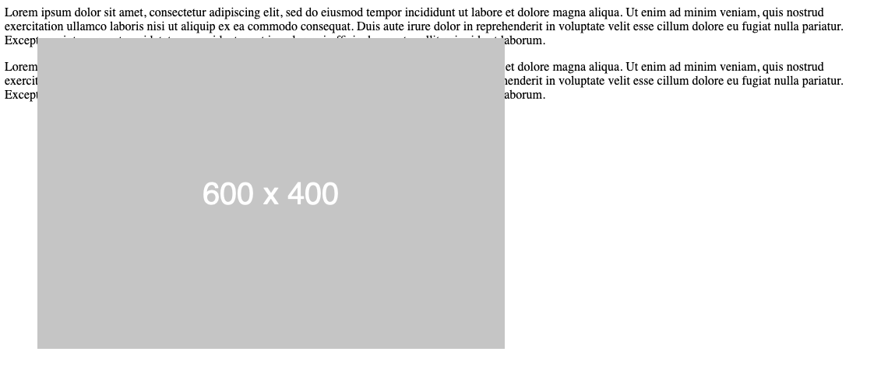
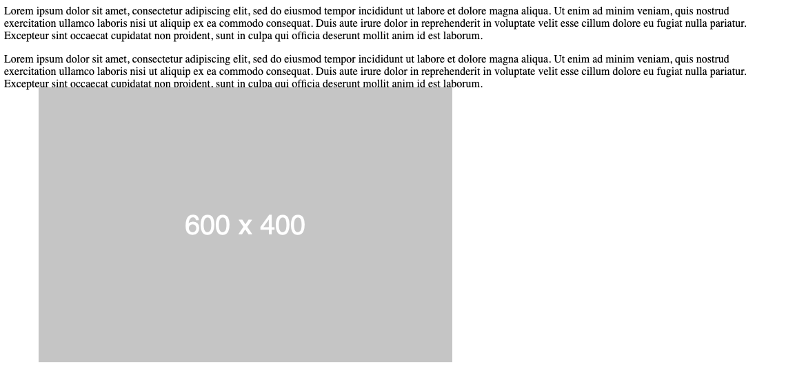
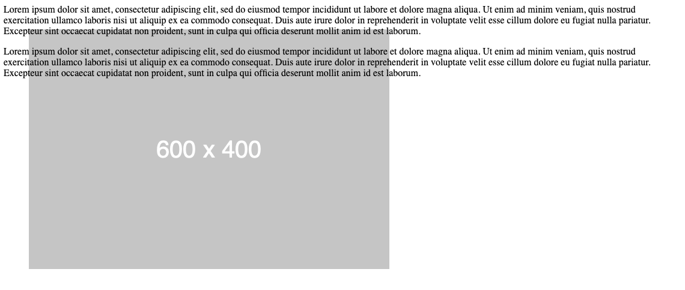
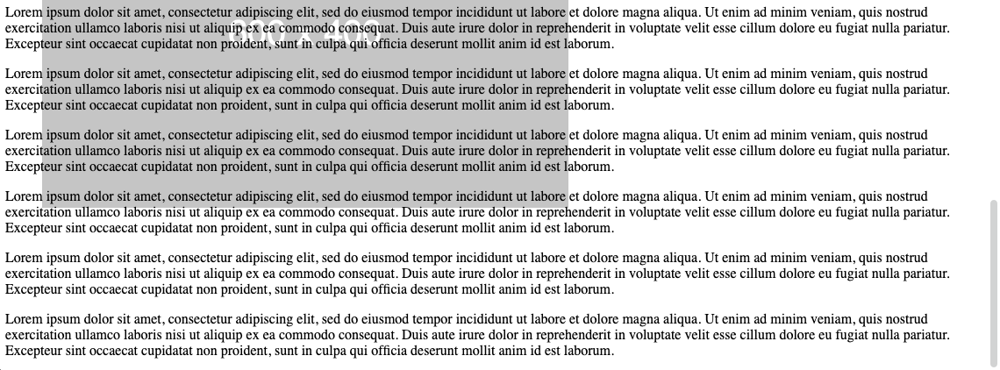
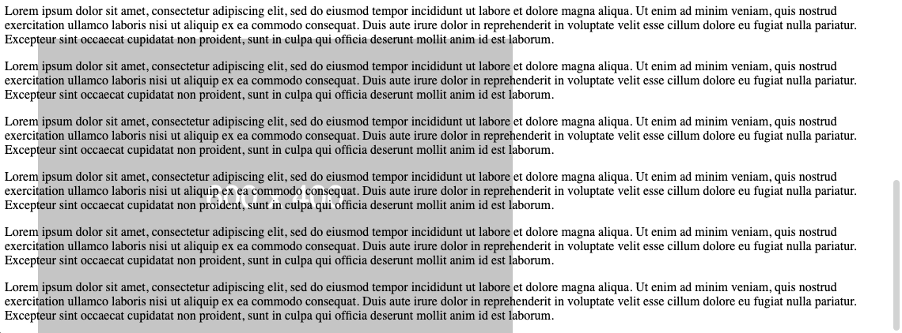

---
layout: template
title: Position absoluut
url: /css/position-absolute
collection: [css]
---							

Door <code>position: absolute</code>te gebruiken in een CSS selector ga het element een absolute postie geven. Het element gaat zich dus niet meer positioneren voor of na het element in de HTML structuur zoals standaard bij block of inline elementen.

De <strong>links-boven positie</strong> is gerelateerd aan het element waar het rond staat met <code>position: relative</code>. Als dat er niet is wordt het body element als referentie gebruikt.

Door <code>left: 100px</code> te gebruiken positioneer je het element 100 pixels naar rechts ten opzicht van de linkse postie van het eerste relatief element. 
Door <code>right: 100px</code> te gebruiken positioneer je het element 100 pixels naar link ten opzicht van de rechtse postie van het eerste relatief element. 
Door <code>top: 100px</code> te gebruiken positioneer je het element 100 pixels naar beneden ten opzicht van de boven postie van het eerste relatief element. 
Door <code>bottom: 100px</code> te gebruiken positioneer je het element 100 pixels naar boven ten opzicht van de onder postie van het eerste relatief element.

Je kan <code>left</code> en <code>right</code> niet samen gebruiken. Ook <code>top</code> en <code>bottom</code> kan je niet samen gebruiken.

<strong>Voorbeeld waarbij <code>&lt;body&gt;<code> als relatief element wordt genomen</strong>

HTML:

<pre data-enlighter-theme="beyond" data-enlighter-language="html">
&lt;img id="visual" src="dummy_600x400_ffffff_cccccc.png" /&gt;
&lt;p&gt;
Lorem ipsum dolor sit amet, consectetur adipiscing elit, 
sed do eiusmod tempor incididunt ut labore et dolore magna 
aliqua. Ut enim ad minim veniam, quis nostrud exercitation 
ullamco laboris nisi ut aliquip ex ea commodo consequat. 
Duis aute irure dolor in reprehenderit in voluptate velit 
esse cillum dolore eu fugiat nulla pariatur. &lt;br /&gt;
Excepteur sint occaecat cupidatat non proident, sunt in culpa qui officia 
deserunt mollit anim id est laborum.
&lt;/p&gt;
&lt;p&gt;
Lorem ipsum dolor sit amet, consectetur adipiscing elit, 
sed do eiusmod tempor incididunt ut labore et dolore magna 
aliqua. Ut enim ad minim veniam, quis nostrud exercitation 
ullamco laboris nisi ut aliquip ex ea commodo consequat. 
Duis aute irure dolor in reprehenderit in voluptate velit 
esse cillum dolore eu fugiat nulla pariatur. &lt;br /&gt;
Excepteur sint occaecat cupidatat non proident, sunt in culpa qui officia 
deserunt mollit anim id est laborum.
&lt;/p&gt;
</pre>

CSS:

<pre data-enlighter-theme="beyond" data-enlighter-language="css">
#visual {
    position: absolute;
    left: 50px;
    top: 50px;
}</pre>

Resultaat:

    

<strong>Voorbeeld waarbij <code>&lt;p&gt;<code> als relatief element wordt genomen</strong>

HTML:

<pre data-enlighter-theme="beyond" data-enlighter-language="html">
&lt;p&gt;
Lorem ipsum dolor sit amet, consectetur adipiscing elit, 
sed do eiusmod tempor incididunt ut labore et dolore magna 
aliqua. Ut enim ad minim veniam, quis nostrud exercitation 
ullamco laboris nisi ut aliquip ex ea commodo consequat. 
Duis aute irure dolor in reprehenderit in voluptate velit 
esse cillum dolore eu fugiat nulla pariatur. &lt;br /&gt;
Excepteur sint occaecat cupidatat non proident, sunt in culpa qui officia 
deserunt mollit anim id est laborum.
&lt;/p&gt;
&lt;p&gt;
&lt;img id="visual" src="dummy_600x400_ffffff_cccccc.png" /&gt;
Lorem ipsum dolor sit amet, consectetur adipiscing elit, 
sed do eiusmod tempor incididunt ut labore et dolore magna 
aliqua. Ut enim ad minim veniam, quis nostrud exercitation 
ullamco laboris nisi ut aliquip ex ea commodo consequat. 
Duis aute irure dolor in reprehenderit in voluptate velit 
esse cillum dolore eu fugiat nulla pariatur. &lt;br /&gt;
Excepteur sint occaecat cupidatat non proident, sunt in culpa qui officia 
deserunt mollit anim id est laborum.
&lt;/p&gt;
</pre>

CSS:

<pre data-enlighter-theme="beyond" data-enlighter-language="css">
p {
    position: relative;
}
#visual {
    position: absolute;
    left: 50px;
    top: 50px;
}</pre>

Resultaat:

    

<h2>z-index</h2>

Via het <code>z-index</code> attribuut kan je de volgorde bepalen om zo (absolute) elementen naar voor of achter te verplaatsen. <strong>Standaard</strong> heeft de z-index de <strong>waarde 0</strong>.

CSS:

<pre data-enlighter-theme="beyond" data-enlighter-language="css">
#visual {
    position: absolute;
    left: 50px;
    top: 50px;
    z-index: -1;
}</pre>

    

<h2>absolute vs fixed</h2>

Bij het gebruik van <code>position: absolute</code> zal het element nog mee scrollen. Dit komt omdat de links-boven positie wordt bepaald door het relatief gepositioneerde element er rond.
 

Als je <code>position: fixed</code> gebruikt blijft de positie gefixeerd, ook als je scrollt. De <strong>links-boven positie</strong> is dan gerelateerd aan de lins-boven positie van het <strong>scherm</strong>.

<code>absolute</code> en dan omlaag gescrollt:

    

<code>fixed</code> en dan omlaag gescrollt:

    

<h2>absoluut binnen een element <code>position: relative</code></h2>