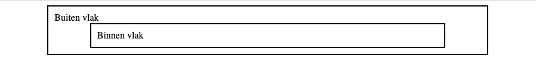

---
layout: template
title: Element centreren
url: /css/ruimte/centreren
collection: [css, ruimte]
---								

Je kan <code>margin</code> ook gebruiken om een element te centreren binnen zijn moeder element.

<u>HTML</u>:
<pre data-enlighter-theme="beyond" data-enlighter-language="html">
&lt;div class="vlak"&gt;
  Buiten vlak
  &lt;div class="vlak"&gt;
    Binnen vlak
  &lt;/div&gt;
&lt;/div&gt;
</pre>

<u>CSS</u>:
<pre data-enlighter-theme="beyond" data-enlighter-language="css">
.vlak {
  margin: auto;
  border: 2px solid #000;
  padding: 10px;
  width: 80%;
}
</pre>

<u>resultaat</u>:

