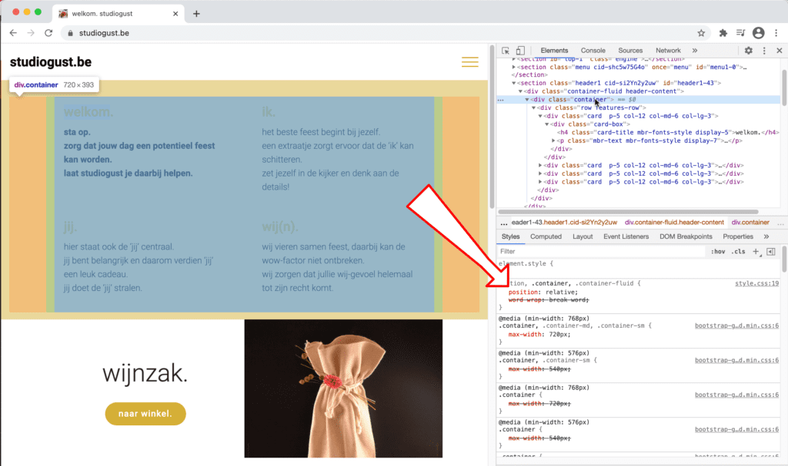

## Selecteer een element en inspecteer de CSS

Rechts onder zie je de CSS die van toepassing is op het geselecteerde element.

## Je ziet de hiërachie en prioriteiten van CSS

Doorstreept wil zeggen dat de regel is over-ruled door een andere regel.