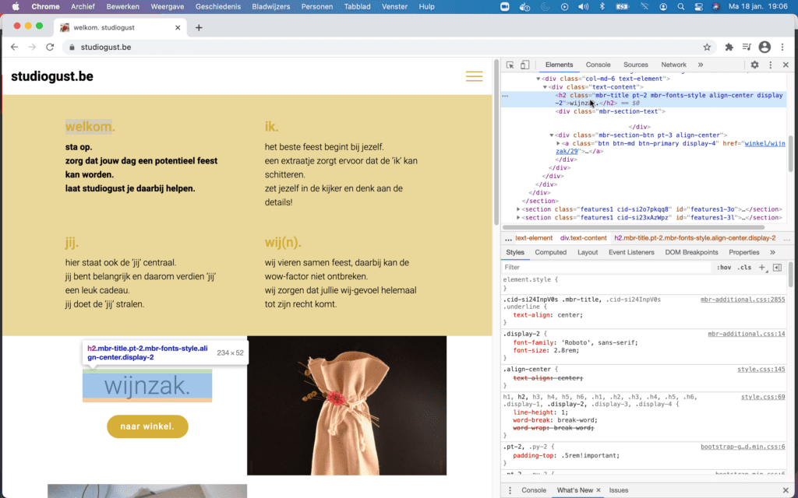

## Rechtermuisknop in een webpagina

De inspectietool kan je gebruiken door in de webpagina op de recht muisknop te klikken.

## Extra paneel

Rechts zie je een extra paneel met de HTML van de webpagina.

## Selecteren en oplichting

Door in het paneel een HTML element te selecteren zie je dat ook oplichten in de pagina.

## Padding en margin

Het groene balkje geeft de padding aan. 
Het oranje balkje geeft de marge aan.
