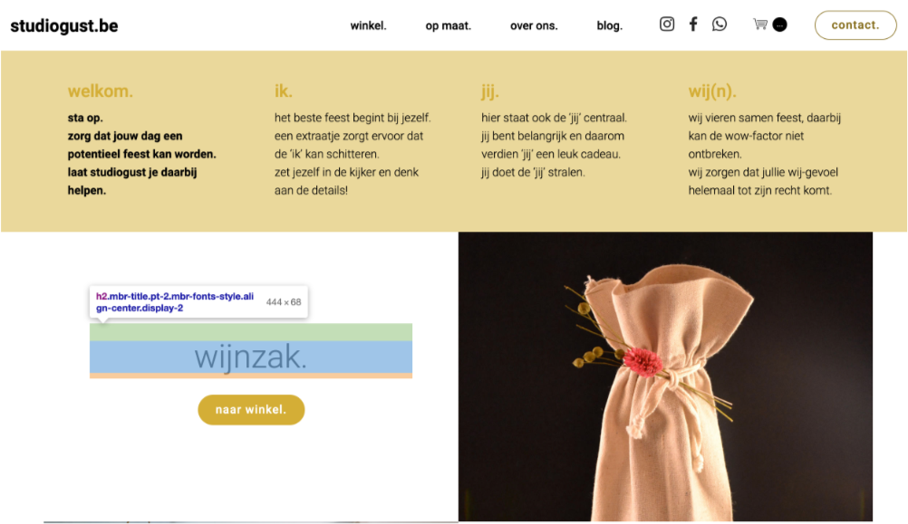
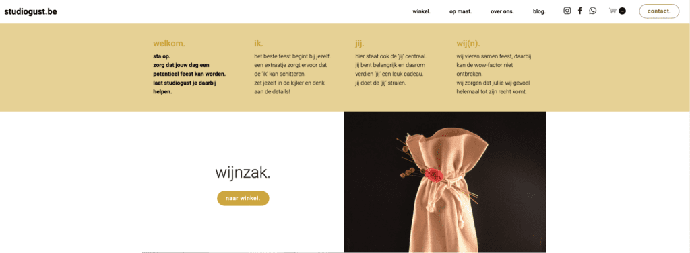
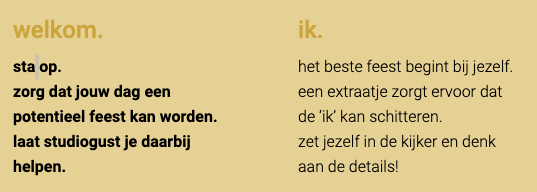

<h2>Doorzoek de website <a target="_blank" href="https://www.studiogust.be">https://www.studiogust.be</a> via de inspectietool en geef de oplossing op de 10 vragen.</h2>

<ol>
<li>Welke achtergrond kleur heeft element met class “header1”?
</li>
<li>Geef de marge en padding van het element met inhoud “wijnzak.”

</li>
<li>De inhoud is “boxed”. Wat is de maximum breedte?

</li>
<li>Wat is de URL van de Facebook pagina?</li>
<li>Wat is ID van het tekstveld?

</li>
<li>Wat is het Whatsapp nummer?</li>
<li>Welk lettertype wordt hier gebruikt?

</li>
<li>Welke lettertype wordt hier gebruikt?

</li>
<li>Hoe dik is de lijn?

</li>
<li>Geef de CSS code voor het rood bolletje

</li>
</ol>
