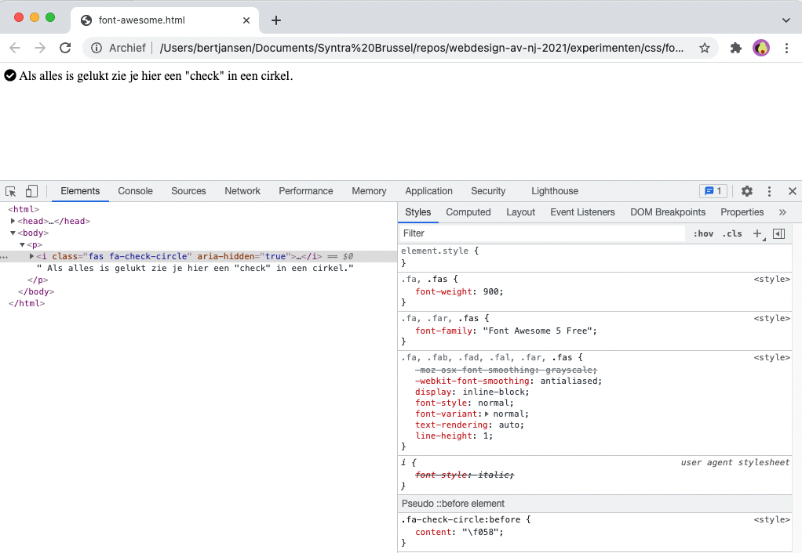

<em>Font Awesome</em> is een bibliotheek die toelaat om een heel aantal symbolen te gebruiken in een website. 

Door <em>Font Awesome</em> in je <code>&lt;head&gt;</code> te laden kan je ze eenvoudig gaan gebruiken in je HTML.

De bibliotheek is <em>as we speak</em> al aan Versie 6. Er zijn betalende iconen maar ook een hele gratis set.

<u>HTML</u>:
<pre data-enlighter-theme="beyond" data-enlighter-language="html">
&lt;html&gt;
  &lt;head&gt;
    &lt;script src="https://kit.fontawesome.com/2d03a6046d.js"&gt;&lt;/script&gt;
  &lt;/head&gt;
  &lt;body&gt;
    &lt;p&gt;&lt;i class="fas fa-check-circle"&gt;&lt;/i&gt; Als alles is gelukt zie je hier een "check" in een cirkel.&lt;/p&gt;    
  &lt;/body&gt;
&lt;/html&gt;
</pre>

<u>Resultaat</u>:

## FONT awesome
De bibliotheek draagt <em>font</em> in haar naam omdat ze eigenlijk een extra lettertype laadt in je webpagina dat via een  set van classes in de HTML wordt geladen. In het voorbeeld hierboven gaat het om de classes <code>fas fa-check-circle</code>.

