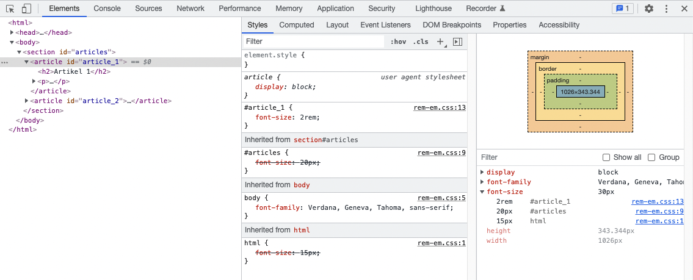

## Absolute waardes
Bij het bepalen van de hoogte, breedte, lettertype, marges en padding maken we gebruik van een waarde. Tot nu gebruikten vooral "px" om het aantal pixels te bepalen. De meeteenheid die op een scherm wordt gebruikt. Een <strong>px</strong> (pixel) is <strong>absoluut</strong>, net zoals mm, cm, ... . 

<u>HTML</u>:
<pre data-enlighter-theme="beyond" data-enlighter-language="html">
&lt;section class="box rood"&gt;vierkant&lt;/section&gt;
&lt;section class="box blauw"&gt;vierkant&lt;/section&gt;
</pre>

<u>CSS</u>:
<pre data-enlighter-theme="beyond" data-enlighter-language="css">
.box {
  height: 200px;
  height: 200px;
}

.rood {
  color: red;
}

.blauw {
  color: blue;
}
</pre>

Absolute waardes hebben als probleem dat ze zich niet aanpassen aan de breedte van het scherm.

Overal absolute waardes definiëren maakt de website ook moeilijker aanpasbaar. 

## Relatieve waardes

Er zijn ook <strong>relatieve</strong> waardes. Tot nu gebruikte we bv. <strong>%</strong> daar al voor. Het maakt dat een maat relatief wordt bepaald ten opzichte van bijvoorbeeld de maat van een element er rond.

Zeer algemeen gesteld baseert een relatieve waarde zich op de waarde van zijn parent element of het root element (<code>&lt;html&gt;</code>).

### rem

Wanneer je <code>rem</code> gebruikt zal de waarde worden bepaald door de lettergroote (<code>font-size</code>) op het root element <code>&lt;html&gt;</code>.

<u>HTML</u>:
<pre data-enlighter-theme="beyond" data-enlighter-language="html">
&lt;section&gt;
  &lt;p id="paragraaf_1"&gt;paragraaf 1&lt;/p&gt;
  &lt;p id="paragraaf_2"&gt;paragraaf 2&lt;/p&gt;
&lt;/section&gt;
</pre>

<u>CSS</u>:
<pre data-enlighter-theme="beyond" data-enlighter-language="css">
html {
  font-size: 16px;
}

#paragraaf_1 {
  font-size: 1.5rem; /* 24px */
}

#paragraaf_2 {
  font-size: 2rem; /* 32px */
}
</pre>

### em 

Wanneer je <code>em</code> gebruikt zal de waarde worden bepaald door de lettergroote (<code>font-size</code>) op zijn parent element.
 
<u>CSS</u>:
<pre data-enlighter-theme="beyond" data-enlighter-language="css">
html {
  font-size: 16px;
}

section {
  font-size: 30px;
}

#paragraaf_1 {
  font-size: 2em; /* 60px */
}

#paragraaf_2 {
  font-size: 2rem; /* 32px */
}
</pre>

    <h3>TIP</h3>
    

    Gebruik de inspectie tool om de effectieve waardes te inspecteren.
     
    
    

